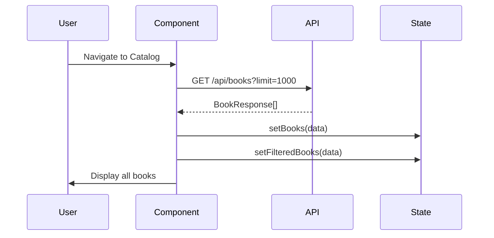
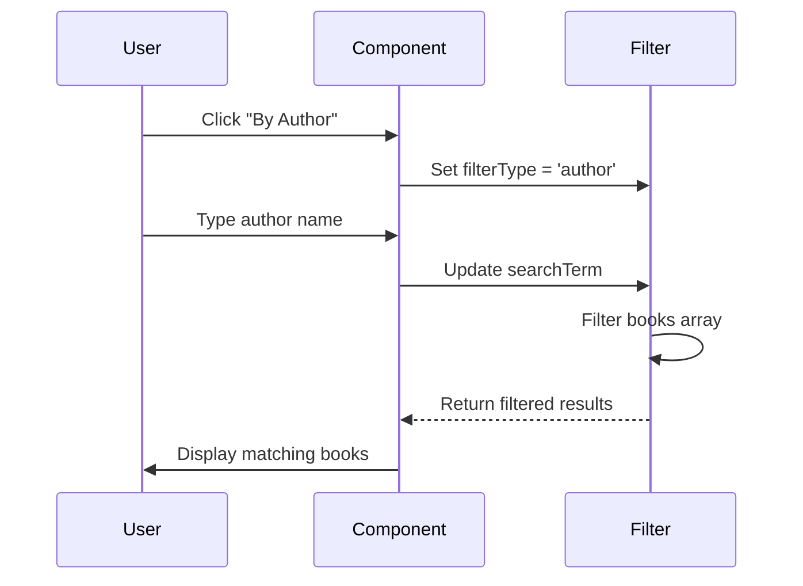
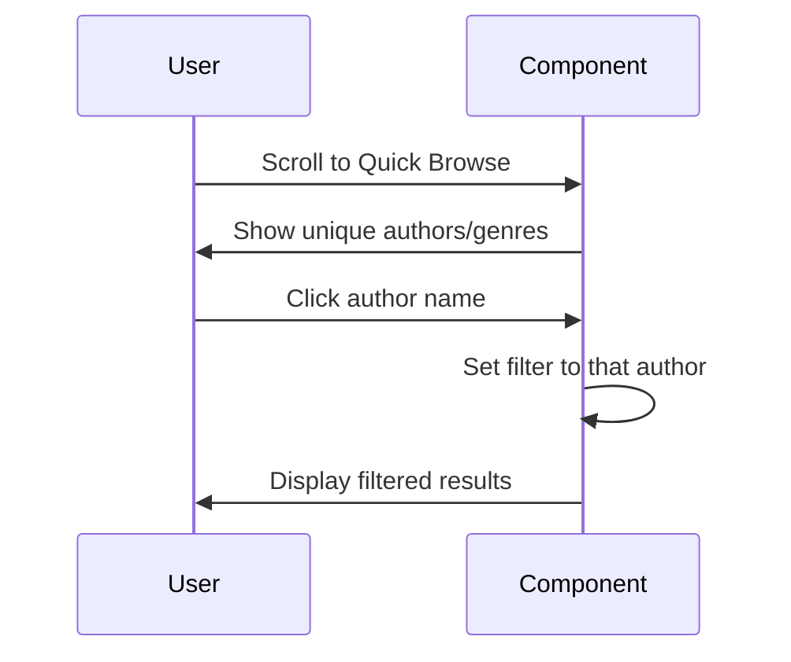

# Book Catalog Feature

## Overview

The Book Catalog page allows users to browse and search the library collection by author, genre, or any field. The interface maintains the ancient library aesthetic with card-based layouts resembling catalog cards from traditional libraries.

## Features

### ✅ **Search & Filter Capabilities**

**Filter Types:**
1. **All Fields** - Search across title, author, genre, and ISBN
2. **By Author** - Filter specifically by author name
3. **By Genre** - Filter specifically by genre

**Search Behavior:**
- Real-time client-side filtering
- Case-insensitive search
- Partial match support
- Clear button to reset search

### ✅ **Book Display**

**Book Card Information:**
- Book title (Playfair Display heading)
- Catalog number (№ ID)
- Author name
- Genre (if available)
- ISBN (monospace font)
- Copy availability (Available vs Total)
- Cataloging date

**Visual Design:**
- Parchment-colored cards
- Ornamental corner flourishes
- Double border with gold accents
- Hover effects with elevation
- Responsive grid layout

### ✅ **Quick Browse**

When no search is active:
- **Browse by Author** - Shows up to 10 authors with quick filter buttons
- **Browse by Genre** - Shows up to 10 genres with quick filter buttons
- One-click filtering by clicking author/genre names

### ✅ **Empty States**

**No Books:**
> "The library shelves await their first volume."

**No Results:**
> "No volumes found matching your search. Total collection: X volumes."

## API Integration

### **Endpoint Used**
```
GET http://localhost:8000/api/books?limit=1000
```

**Response Format:**
```typescript
BookResponse[] = [
  {
    id: number;
    isbn: string;
    title: string;
    author: string;
    genre: string | null;
    available_copies: number;
    total_copies: number;
    created_at: string; // ISO 8601
    updated_at: string; // ISO 8601
  }
]
```

**Client-Side Filtering:**
All filtering is performed client-side after fetching the complete collection. This approach:
- ✅ Reduces server load
- ✅ Provides instant search results
- ✅ Works well for small to medium collections
- ⚠ May need server-side pagination for very large collections (1000+ books)

## Component Structure

```
BookCatalog/
├── BookCatalog.tsx         # Main component
└── BookCatalog.css         # Ancient library styling
```

### **State Management**

```typescript
// Books data
const [books, setBooks] = useState<BookResponse[]>([]);
const [filteredBooks, setFilteredBooks] = useState<BookResponse[]>([]);

// UI state
const [isLoading, setIsLoading] = useState<boolean>(true);
const [error, setError] = useState<string>('');

// Filter state
const [filters, setFilters] = useState<CatalogFilters>({
  searchTerm: '',
  filterType: 'all' | 'author' | 'genre'
});
```

## User Flow

### **1. Initial Load**


### **2. Search by Author**


### **3. Quick Browse**


## Navigation

### **Page Switching**
Simple state-based navigation in App.tsx:

```typescript
type Page = 'catalog' | 'add';
const [currentPage, setCurrentPage] = useState<Page>('catalog');

// Navigation buttons
<button onClick={() => setCurrentPage('catalog')}>Browse Collection</button>
<button onClick={() => setCurrentPage('add')}>Add Volume</button>
```

**Benefits:**
- No router dependency
- Instant page switching
- Simple implementation
- Maintains state between switches

**Navigation Buttons:**
- **Browse Collection** - Opens Book Catalog
- **Add Volume** - Opens Add Book Form
- Active page highlighted with leather texture

## Design Decisions

### **Why Client-Side Filtering?**

✅ **Pros:**
- Instant search results (no API delay)
- Reduced server load
- Simple implementation
- Works offline after initial load

⚠ **Cons:**
- All data loaded upfront
- Not suitable for very large collections
- No server-side search features (fuzzy matching, relevance scoring)

**Recommendation:** For collections under 1,000 books, client-side filtering is ideal. For larger collections, implement server-side search with pagination.

### **Card Layout vs Table**

Chose **card layout** over table because:
- Better suits ancient library aesthetic
- Resembles physical catalog cards
- More responsive on mobile
- Easier to add rich formatting
- Better visual hierarchy

### **Filter Type Buttons**

Three filter modes:
1. **All Fields** (default) - Broadest search
2. **By Author** - Specific use case ("show me books by X")
3. **By Genre** - Browsing by category

Users can switch between modes without losing search text.

## Accessibility

✅ **ARIA Labels:**
- Search input: `aria-label="Search books"`
- Clear button: `aria-label="Clear search"`
- Filter buttons: Semantic button elements

✅ **Keyboard Navigation:**
- All buttons keyboard accessible
- Focus states clearly visible (gold highlight)
- Tab order logical

✅ **Screen Readers:**
- Semantic HTML structure
- Alert roles for error messages
- Clear loading states

## Performance Considerations

### **Optimization Techniques**

1. **useEffect Dependencies:**
   ```typescript
   // Only re-filter when books or filters change
   useEffect(() => {
     applyFilters();
   }, [books, filters]);
   ```

2. **Memoization Candidates:**
   - `uniqueAuthors` - Computed from books
   - `uniqueGenres` - Computed from books
   - Could use `useMemo` for large collections

3. **Lazy Loading (Future):**
   - Virtual scrolling for 100+ cards
   - Pagination for 1000+ books
   - Image lazy loading if book covers added

## Responsive Behavior

### **Desktop (> 768px)**
- Grid: 2-3 columns depending on screen width
- Horizontal filter buttons
- Side-by-side Quick Browse sections

### **Mobile (≤ 768px)**
- Grid: Single column
- Stacked filter buttons (full width)
- Vertical Quick Browse sections
- Larger touch targets

## Error Handling

### **Network Errors**
```typescript
try {
  const response = await fetch(...);
  // ...
} catch (err) {
  setError(`Network error: ${err.message}. Please check if the server is running.`);
}
```

### **Empty Results**
- Clear messaging
- Shows total collection count
- Suggests clearing filters

### **Loading States**
- Spinner animation
- "Retrieving volumes from the archives..." message
- Disabled refresh button during load

## Future Enhancements

### **Potential Features**

1. **Advanced Search:**
   - Date range filtering (catalogued between X and Y)
   - Availability filter (only show available books)
   - Multi-field AND/OR logic

2. **Sorting:**
   - By title (A-Z)
   - By author (A-Z)
   - By date added (newest/oldest)
   - By availability

3. **Book Details Page:**
   - Click card to see full details
   - Edit/delete capabilities
   - Loan history

4. **Export Capabilities:**
   - Download catalog as CSV
   - Print catalog cards
   - Generate reports

5. **Pagination:**
   - Server-side pagination for large collections
   - Page size selector (25/50/100)
   - Jump to page

6. **Saved Searches:**
   - Bookmark common searches
   - Recent searches list
   - Search history

## Testing Checklist

### **Functional Tests**

- [ ] Fetches books on mount
- [ ] Displays all books initially
- [ ] Filter by author works
- [ ] Filter by genre works
- [ ] Search all fields works
- [ ] Clear button resets search
- [ ] Refresh button refetches data
- [ ] Quick browse links filter correctly
- [ ] Empty state shows when no books
- [ ] No results state shows when search returns empty
- [ ] Error state shows on network failure
- [ ] Loading state shows during fetch

### **UI/UX Tests**

- [ ] Cards display correctly on desktop
- [ ] Cards stack on mobile
- [ ] Filter buttons highlight active state
- [ ] Search input accepts text
- [ ] Clear button appears when search has text
- [ ] Hover effects work on cards
- [ ] Navigation buttons switch pages
- [ ] Ancient library theme consistent

### **Accessibility Tests**

- [ ] Keyboard navigation works
- [ ] Screen reader announces results count
- [ ] Focus visible on all interactive elements
- [ ] Color contrast meets WCAG AA
- [ ] Alt text on any icons (if added)

## Integration with Add Book Form

**Workflow:**
1. User adds book via "Add Volume" page
2. Book saved to database (POST /api/books)
3. User clicks "Browse Collection"
4. User clicks "Refresh Collection" to see new book
5. New book appears in catalog

**Enhancement Opportunity:**
Auto-refresh catalog after adding book:
```typescript
// In AddBookForm, after successful create:
onSuccess={(newBook) => {
  // Navigate to catalog
  setCurrentPage('catalog');
  // Trigger refresh
  catalogRef.current?.refresh();
}}
```

## Styling Tokens

### **Catalog-Specific Colors**
```css
/* Cards */
--card-background: linear-gradient(to bottom, #F4ECD8 0%, #EDE4D0 100%);
--card-border: #C19A6B;
--card-border-hover: #D4AF37;
--card-shadow: rgba(43, 24, 16, 0.15);

/* Stats */
--stat-available-color: #2B5329; /* Dark green */
--stat-total-color: #2B1810;     /* Dark brown */

/* Controls */
--control-background: #F4ECD8;
--control-border: #C19A6B;
--control-text: #4A3728;
```

## Summary

The Book Catalog feature provides a comprehensive, searchable view of the library collection with:

✅ **Functionality** - Search by author, genre, or all fields  
✅ **Design** - Ancient library card catalog aesthetic  
✅ **Performance** - Client-side filtering for instant results  
✅ **Accessibility** - WCAG AA compliant with keyboard navigation  
✅ **Responsive** - Works on all screen sizes  
✅ **Integration** - Seamless navigation with Add Book form  

The feature is production-ready for small to medium library collections and provides a solid foundation for future enhancements like advanced search, sorting, and pagination.